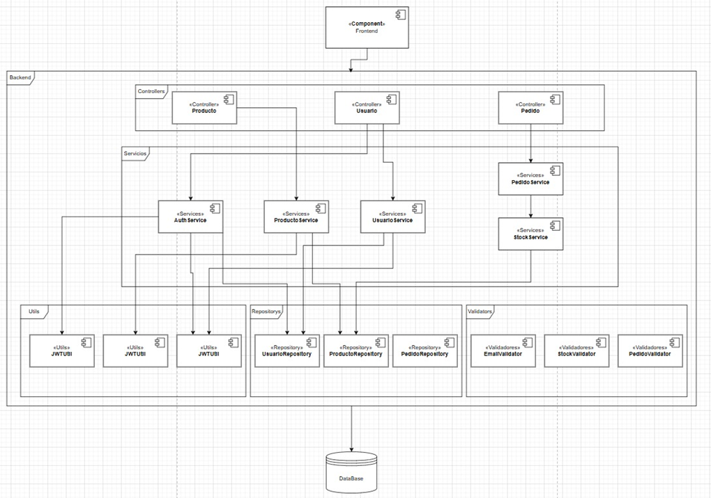
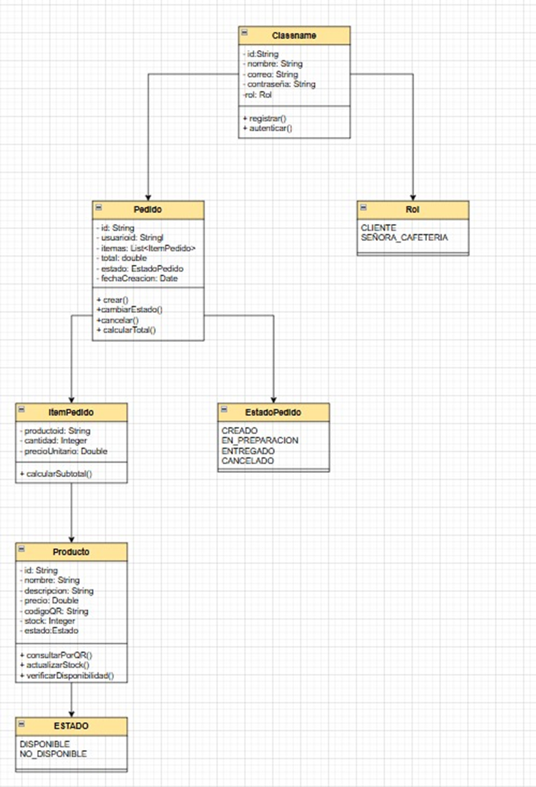
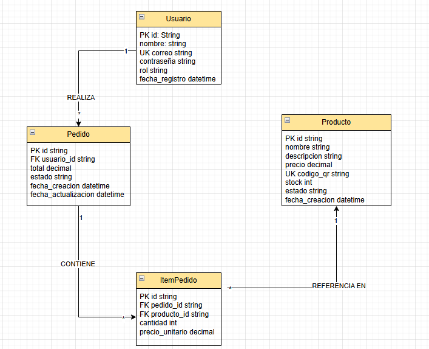
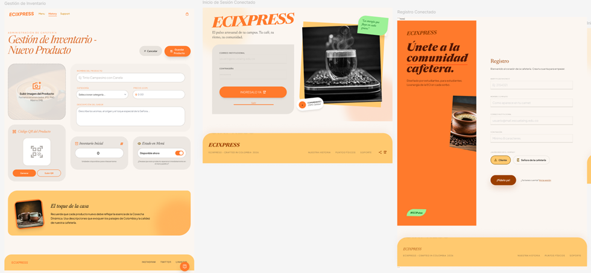
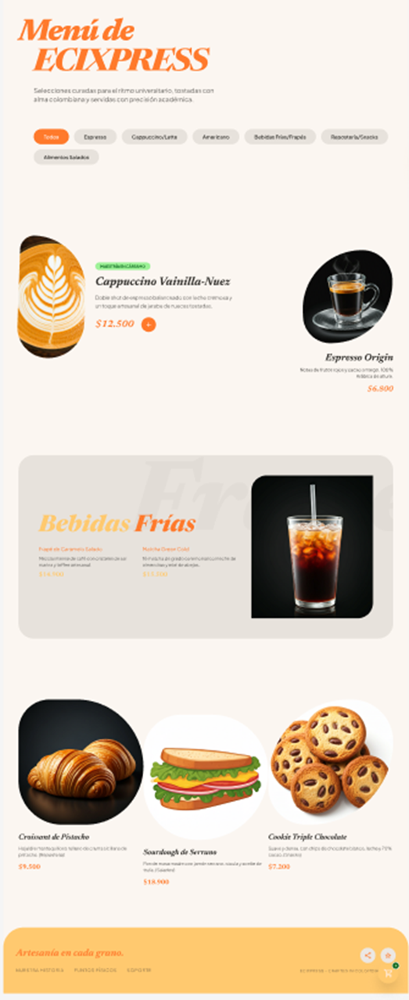
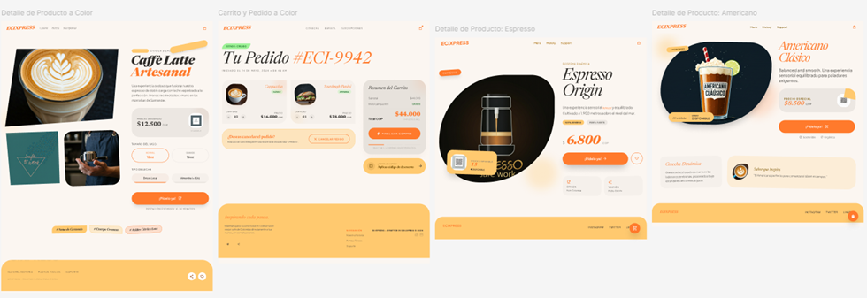
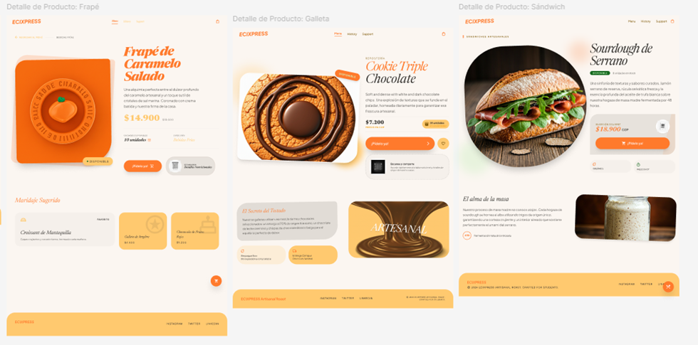

# DOSW_ParcialT2_JeyderLeon

# Jeyder Nicolay leon Lancheros
# GRUPO 1


- Compilar proyecto: mvn clean compile
- Ejecutar tests (JUnit + Mockito): mvn test
- Ejecutar verificación completa (incluye JaCoCo report): mvn clean verify
- Swagger UI: http://localhost:8080/swagger-ui/index.html
- OpenAPI JSON: http://localhost:8080/v3/api-docs
- Ejecutar análisis SonarQube: mvn clean verify sonar:sonar 
- Dsonar.projectKey=DOSW-ParcialT2 
- Dsonar.host.url=http://localhost:9000 
- Dsonar.login=TU_TOKEN
- SonarQube UI: http://localhost:9000
- Levantar la app Spring Boot: mvn spring-boot:run
- App local: http://localhost:8080


# Punto 1

# analisis de funcionalidades - ECIXPRESS

## 1. registro con correo institucional

**verbo HTTP:** POST

**descripcion:** cualquier persona con correo institucional puede registrarse proporcionando nombre, correo y contrasena. el sistema crea la cuenta y devuelve la informacion basica del usuario.

**idempotencia:** no es una operacion idempotente: intentar crear el mismo usuario dos veces dara lugar a un conflicto.

**razon tecnica:** POST crea un nuevo recurso cada vez que se invoca.

**roles con acceso:** publico (sin autenticacion)

**datos de entrada:**
- nombre: string (obligatorio)
- correo: string (obligatorio)
- contrasena: string (obligatorio)

**datos de salida:**
- id: string
- nombre: string
- correo: string
- rol: string

**ejemplo de entrada:**
```json
{
  "nombre": "Juan Perez",
  "correo": "juan.perez@universidad.edu.co",
  "contrasena": "Pass123!"
}
```

**ejemplo de salida:**
```json
{
  "id": "usr_123",
  "nombre": "Juan Perez",
  "correo": "juan.perez@universidad.edu.co",
  "rol": "cliente"
}
```

**validaciones de input:**
- nombre no vacio
- correo formato valido
- contrasena no vacia

**validaciones de negocio:**
- el correo debe pertenecer al dominio institucional
- el correo debe ser unico en la base de datos
- la contrasena debe cumplir requisitos minimos de seguridad (minimo 8 caracteres, mayuscula, numero)

**codigos HTTP:**
- **caso exitoso:** 201 Created - "usuario creado correctamente"
- **errores posibles:**
  - 400 Bad Request: "datos invalidos"
  - 409 Conflict: "el correo ya existe"

---

## 2. inicio de sesion

**verbo HTTP:** POST

**descripcion:** permite a un usuario autenticarse con correo y contrasena. si las credenciales son validas se devuelve un token de acceso y la informacion del usuario.

**idempotencia:** no es idempotente en el sentido practico porque genera credenciales de sesion (token) diferentes en cada llamada.

**razon tecnica:** POST genera un nuevo token de sesion en cada invocacion.

**roles con acceso:** publico (sin autenticacion)

**datos de entrada:**
- correo: string (obligatorio)
- contrasena: string (obligatorio)

**datos de salida:**
- token: string
- usuario: object

**ejemplo de entrada:**
```json
{
  "correo": "juan.perez@universidad.edu.co",
  "contrasena": "Pass123!"
}
```

**ejemplo de salida:**
```json
{
  "token": "eyJhbGciOiJIUzI1NiIsInR5cCI6IkpXVCJ9...",
  "usuario": {
    "id": "usr_123",
    "nombre": "Juan Perez",
    "rol": "cliente"
  }
}
```

**validaciones de input:**
- correo no vacio
- contrasena no vacia
- formato de correo valido

**validaciones de negocio:**
- las credenciales deben ser correctas
- el usuario debe existir en la base de datos

**codigos HTTP:**
- **caso exitoso:** 200 OK - "inicio de sesion exitoso"
- **errores posibles:**
  - 400 Bad Request: "no se evidencia el token"
  - 401 Unauthorized: "credenciales incorrectas"

---

## 3. consultar producto mediante codigo QR

**verbo HTTP:** GET

**descripcion:** al escanear un QR se obtiene la ficha del producto: nombre, descripcion, precio, codigo QR, stock y estado (disponible o no).

**idempotencia:** es una operacion de solo lectura y por tanto idempotente, siempre devolvera el mismo producto para el mismo QR.

**razon tecnica:** GET solo consulta informacion sin modificar el estado del servidor.

**roles con acceso:** cliente, senora de la cafeteria

**datos de entrada:**
- codigoQR: string (obligatorio, en URL)

**datos de salida:**
- id: string
- nombre: string
- descripcion: string
- precio: number
- codigoQR: string
- stock: number
- estado: string

**ejemplo de entrada:**
```
GET /api/productos/QR_CAFE_001
```

**ejemplo de salida:**
```json
{
  "id": "prod_001",
  "nombre": "Cafe Americano",
  "descripcion": "cafe negro 250ml",
  "precio": 2500,
  "codigoQR": "QR_CAFE_001",
  "inventario": 50,
  "estado": "disponible"
}
```

**validaciones de input:**
- codigo QR no vacio
- formato del QR valido

**validaciones de negocio:**
- el producto debe existir en la base de datos

**codigos HTTP:**
- **caso exitoso:** 200 OK - "producto encontrado"
- **errores posibles:**
  - 400 Bad Request: "producto no encontrado"
  - 401 Unauthorized: "no hay autorizacion"
  - 404 Not Found: "el producto no se encontro"

---

## 4. crear pedido con productos escaneados

**verbo HTTP:** POST

**descripcion:** un usuario autenticado puede crear un pedido enviando la lista de productos (identificador o codigo QR) y las cantidades. el pedido se guarda con estado inicial CREADO y se devuelve su identificador, total y fecha.

**idempotencia:** no es idempotente, cada pedido tiene productos distintos y genera un nuevo recurso con identificador unico.

**razon tecnica:** POST crea un nuevo recurso (pedido) cada vez.

**roles con acceso:** cliente

**datos de entrada:**
- productos: array (obligatorio)
  - productoId: string
  - cantidad: number

**datos de salida:**
- id: string
- usuarioId: string
- productos: array
- total: number
- estado: string
- fechaCreacion: string

**ejemplo de entrada:**
```json
{
  "productos": [
    {"productoId": "prod_001", "cantidad": 2},
    {"productoId": "prod_002", "cantidad": 1}
  ]
}
```

**ejemplo de salida:**
```json
{
  "id": "ped_001",
  "usuarioId": "usr_123",
  "productos": [
    {
      "productoId": "prod_001",
      "nombre": "Cafe",
      "cantidad": 2,
      "precio": 2500
    }
  ],
  "total": 7500,
  "estado": "CREADO",
  "fechaCreacion": "2024-04-10T14:30:00Z"
}
```

**validaciones de input:**
- lista de items no vacia
- cada item debe tener producto y cantidad
- cantidades deben ser mayores a cero

**validaciones de negocio:**
- los productos deben existir en la base de datos
- debe haber stock suficiente para cada producto
- el usuario no debe tener ya un pedido activo

**codigos HTTP:**
- **caso exitoso:** 201 Created - "pedido creado exitosamente"
- **errores posibles:**
  - 400 Bad Request: "no hay productos requeridos"
  - 400 Bad Request: "no hay suficiente stock de el/los productos"
  - 409 Conflict: "tienes un pedido activo"

---

## 5. validar stock antes de confirmar

**verbo HTTP:** POST

**descripcion:** comprueba sin modificar nada si hay stock suficiente para las cantidades solicitadas.

**idempotencia:** es idempotente porque solo consulta el estado del stock sin modificarlo. multiples llamadas con los mismos datos retornan el mismo resultado.

**razon tecnica:** aunque usa POST, es una operacion de consulta que no modifica el estado.

**roles con acceso:** cliente, senora de la cafeteria

**datos de entrada:**
- productos: array (obligatorio)
  - productoId: string
  - cantidad: number

**datos de salida:**
- validacion: array
  - productoId: string
  - cantidadSolicitada: number
  - cantidadDisponible: number
  - suficiente: boolean

**ejemplo de entrada:**
```json
{
  "productos": [
    {"productoId": "prod_001", "cantidad": 2}
  ]
}
```

**ejemplo de salida:**
```json
{
  "validacion": [
    {
      "productoId": "prod_001",
      "cantidadSolicitada": 2,
      "cantidadDisponible": 50,
      "suficiente": true
    }
  ]
}
```

**validaciones de input:**
- lista de items no vacia
- cantidades deben ser positivas

**validaciones de negocio:**
- los productos deben existir en la base de datos

**codigos HTTP:**
- **caso exitoso:** 200 OK - "stock disponible"
- **errores posibles:**
  - 400 Bad Request: "el producto no existe"
  - 404 Not Found: "producto no encontrado"

---

## 6. un usuario solo puede tener un pedido activo

**verbo HTTP:** GET

**descripcion:** regla de negocio que impide a un usuario crear un nuevo pedido si ya tiene uno en estado activo (por ejemplo CREADO o EN_PREPARACION). GET devuelve el pedido activo si existe.

**idempotencia:** como es una operacion de solo lectura es idempotente. consulta el estado sin modificar nada.

**razon tecnica:** GET solo consulta informacion.

**roles con acceso:** cliente

**datos de entrada:**
- usuarioId: string (en token/sesion)

**datos de salida:**
- pedidoActivo: object o null
  - id: string
  - estado: string
  - fechaCreacion: string

**ejemplo de entrada:**
```
GET /api/pedidos/activo
```

**ejemplo de salida:**
```json
{
  "pedidoActivo": {
    "id": "ped_001",
    "estado": "CREADO",
    "fechaCreacion": "2024-04-10T14:30:00Z"
  }
}
```

**validaciones de input:**
- usuario autenticado

**validaciones de negocio:**
- verificar si existe pedido en estado CREADO o EN_PREPARACION para el usuario

**codigos HTTP:**
- **caso exitoso:** 200 OK - "consulta del estado exitosa"
- **errores posibles:**
  - 400 Bad Request: "hay ya un pedido en curso"
  - 401 Unauthorized: "usuario no autenticado"

---

## 7. gestion de estados del pedido

**verbo HTTP:** PATCH

**descripcion:** el personal de la cafeteria puede actualizar pedidos a EN_PREPARACION y luego a ENTREGADO. el cliente puede cancelar solo si el pedido esta en CREADO. al confirmar la entrega el sistema debe ajustar el stock.

**idempotencia:** no es idempotente ya que busca actualizar el estado del pedido. cada transicion de estado es unica y modifica el recurso.

**razon tecnica:** PATCH modifica parcialmente el recurso y cada transicion de estado es significativa.

**roles con acceso:** cliente (para cancelar), senora de la cafeteria (para cambiar a EN_PREPARACION/ENTREGADO)

**datos de entrada:**
- pedidoId: string (en URL)
- estado: string (obligatorio)

**datos de salida:**
- id: string
- estado: string
- fechaActualizacion: string

**ejemplo de entrada:**
```
PATCH /api/pedidos/ped_001
```
```json
{
  "estado": "EN_PREPARACION"
}
```

**ejemplo de salida:**
```json
{
  "id": "ped_001",
  "estado": "EN_PREPARACION",
  "fechaActualizacion": "2024-04-10T14:35:00Z"
}
```

**validaciones de input:**
- estado objetivo no vacio
- estado debe ser valido (EN_PREPARACION, ENTREGADO, CANCELADO)

**validaciones de negocio:**
- control de permisos por rol
- el cliente solo puede cancelar si esta en CREADO
- la cafeteria puede cambiar a EN_PREPARACION y ENTREGADO
- restricciones en transiciones de estado
- al confirmar entrega ajustar stock

**codigos HTTP:**
- **caso exitoso:** 200 OK - "estado del pedido actualizado"
- **errores posibles:**
  - 400 Bad Request: "el estado del pedido no se puede actualizar"
  - 403 Forbidden: "el rol no es permitido para la accion"

---


# Punto 2

# diferencia entre validaciones de input y de negocio

## validaciones de input

comprueban que los datos recibidos tienen el formato correcto, sin importar la logica de la aplicacion.

- campos obligatorios presentes
- formato de correo valido
- tipos de datos correctos
- longitudes y rangos permitidos

**donde:** controlador / DTO  
**para que:** evitar errores basicos antes de procesar cualquier cosa


## validaciones de negocio

comprueban que la operacion tiene sentido segun las reglas del sistema.

- hay stock suficiente para el pedido
- el usuario no tiene otro pedido activo
- el correo pertenece al dominio institucional
- solo el personal puede marcar un pedido como entregado

**donde:** capa de servicio / dominio  
**para que:** proteger la coherencia del negocio


## diferencias clave

| aspecto | input | negocio |
|---|---|---|
| momento | al recibir la peticion | durante el procesamiento |
| capa | controlador/DTO | servicio/dominio |
| depende de | solo los datos enviados | estado del sistema y BD |
| ejemplo | correo con formato valido | correo no registrado aun |


## ejemplo en ECIXPRESS: crear pedido

**input:** lista no vacia, IDs presentes, cantidades positivas  
**negocio:** productos existen, hay stock, el usuario no tiene pedido activo

# Punto 3

Autenticación: comprobar quién es el usuario

Autorización: decidir qué puede hacer el usuario.

Integridad: asegurar que los datos no fueron alterados.

# Punto 4


# Punto 5

- Mantenimiento difícil: cambios pequeños rompen partes no relacionadas.
- Pruebas complicadas: imposible aislar lógica para unit tests.
- Acoplamiento alto: impide reemplazar o refactorizar componentes.
- Pérdida de reutilización: la lógica no sirve en otros contextos.
- Riesgos operativos y de seguridad: validaciones dispersas y despliegues más complejos.

# punto 6


- los controladores reciben las peticiones y llaman a los servicios. los servicios tienen la logica de negocio y usan repositorios para acceder a la base de datos. los validadores verifican reglas especificas y las utilidades son funciones auxiliares como generar tokens o hashear contraseñas.

## Punto 7

# Diferencias entre Validador, Utilidad y Servicio

## Validador

**que es:** componente que verifica que los datos cumplen reglas concretas como formatos, rangos o campos obligatorios.

**responsabilidad:** validar entrada y devolver errores claros. no realiza logica de negocio ni efectos secundarios.

**donde se usa:** capas de entrada como controladores, DTOs o antes de ejecutar una operacion de negocio.

**ejemplo:** comprobar que un email tenga formato valido o que una cantidad sea positiva.

**prueba:** tests unitarios centrados en reglas de validacion.

---

## Utilidad (helper)

**que es:** funcion o clase pequeña que aporta una operacion reutilizable y tecnica, sin estado ni contexto de dominio.

**responsabilidad:** resolver tareas auxiliares como formatos, conversiones o calculos sencillos de forma pura y reutilizable.

**donde se usa:** en cualquier capa que necesite la operacion. no deberia contener logica de negocio.

**ejemplo:** formatear una fecha, calcular el hash de un string, convertir moneda.

**prueba:** tests unitarios que verifiquen entradas y salidas para casos representativos.

---

## Servicio

**que es:** componente que encapsula la logica de negocio, coordina validadores, utilidades y repositorios.

**responsabilidad:** implementar las reglas del dominio, gestionar transacciones y efectos secundarios como persistencia o envio de eventos.

**donde se usa:** desde controladores o jobs. actua como capa intermedia entre entrada y persistencia.

**ejemplo:** crear un pedido verificando stock, reservar items, guardar el pedido y emitir evento.

**prueba:** tests unitarios sobre la logica mockeando repositorios y pruebas de integracion para efectos secundarios.

# Punto 8


## patron state
**se usaria el patron state para manejar los estados del pedido porque:**
-	encapsula comportamiento por estado: cada estado (CREADO, EN_PREPARACION, ENTREGADO, CANCELADO) tiene comportamientos especificos. por ejemplo, solo en creado se puede cancelar.
-	transiciones controladas: el patron permite definir que transiciones son validas. un pedido en ENTREGADO no puede volver a creado.
-	facilita extension: si se agregan nuevos estados en el futuro, solo se crea una nueva clase sin modificar el codigo existente.
-	elimina condicionales: en lugar de tener muchos if/else para verificar el estado actual, cada estado sabe que puede hacer.

# Punto 9


# explicacion
**el diagrama muestra las relaciones entre las entidades principales:**
-	un usuario puede realizar muchos pedidos
-	un pedido pertenece a un usuario y contiene varios ítems
-	cada item del pedido referencia un producto y guarda la cantidad y precio al momento de la compra
-	los productos tienen un codigo qr unico para ser escaneados


# Punto 10

## Indice único sobre el código QR de productos

La búsqueda por QR es la operación más frecuente al escanear; este índice evita escaneos totales de tabla y devuelve el producto en O(log n). Al ser unico también garantiza integridad del identificador QR, aparte es bueno para la lectura

## Índice compuesto para localizar el pedido activo por usuario

Las comprobaciones “¿tiene el usuario un pedido activo?” y las consultas que filtran por usuario y estado (CREADO/EN_PREPARACION) serán muy rápidas porque el índice cubre el filtro; o hace ligeramente para devolver fecha sin ir a la fila completa. Esto reduce contencion  latencia en el flujo de creacion/validaciOn de pedidos, ademas tiene beneficio porque implementa mejora significativa en rutas críIticas del negocio.

## Punto 11

# TDD para Funcionalidad "Solicitar Pedido" - ECIXPRESS

## Descripcion de las Fases de TDD

**Red (falla):** se escribe primero un test que describa el comportamiento deseado por ejemplo "crea un pedido cuando hay stock". se ejecuta la suite y vemos que falla porque aun no hay implementacion.

**Green (pasa):** se implementa la minima logica necesaria para que ese test pase crear entidad pedido, guardar items, devolver id. ejecutamos y confirmamos que el test ahora pasa.

**Refactor (mejora):** se limpia el codigo sin romper tests. se extraen metodos, mejoran nombres, mueven validaciones a servicios. volvemos a correr todos los tests para asegurarnos de que todo sigue verde.

---

## Casos de Prueba Iniciales

### Escenarios Exitosos
- el usuario solicita un pedido y se valida en la pagina exitosamente
- todos los productos tienen stock disponible
- el pedido se crea con estado CREADO
- el total se calcula correctamente

### Escenarios de Fracaso
- el pedido no es correcto por variaciones en stock
- el pedido no es correcto por validaciones del usuario como tener un pedido activo
- productos inexistentes
- cantidades invalidas

---

## Validaciones Clave

**Validaciones cubiertas por las pruebas:**
- todos los productos del pedido estan en stock
- no hay problemas en cuanto al pedido
- el usuario no tiene otro pedido activo
- los productos existen en la base de datos
- las cantidades son validas y positivas
- el usuario esta autenticado

---

## Como las Pruebas Garantizan Cumplimiento

**Reglas de Negocio:**
- verifican que solo se puede tener un pedido activo
- verifican que el stock es suficiente antes de crear
- verifican que el estado inicial es CREADO
- verifican que el total se calcula bien

**Integridad del Sistema:**
- si falla alguna validacion no se crea el pedido
- el stock no se modifica si el pedido falla
- los datos quedan consistentes ante errores
- las operaciones son transaccionales

---

## Punto 12

Las pruebas convierten las reglas de negocio en comprobaciones automáticas: unit tests validan la lógica, integration tests verifican efectos sobre datos (transacciones) y prueban el flujo completo; ejecutadas en CI detectan regresiones y preservan la integridad del sistema.

---

## Punto 13

Un pipeline CI/CD extrae el código, compila y corre pruebas unitarias, realiza analisis estático, empaqueta y ejecuta pruebas de integración, publica el artefacto y lo despliega para validar, y finalmente mueve lo revisado a produccion. El proposito es automatizar procesos para validar cosas de forma efectiva e individual

---


## Punto 14

Si una prueba falla en el pipeline, no se debe permitir el despliegue automaticamente: el fallo indica que alguna regla o comportamiento esperado esta roto y permitir el despligue aumenta el riesgo de introducir errores en producción. Lo correcto es detener el pipeline, notificar al equipo: corregir el problema, revertir el cambio o crear un hotfix antes de volver a intentar. 

---

## Punto 15

- Registrar: fecha/hora, request-id, endpoint/método, id de usuario (no sensible) y mensaje de error.
- No registrar: contraseñas, tokens, claves privadas, datos personales sensibles.


# Punto 16








https://www.figma.com/design/aDDVSyUknrZHcjv1ebedmV/Sin-t%C3%ADtulo?node-id=0-1&p=f&t=swHOTp5xyZSiJtW3-0


## cobertura jacoco y sonar


## video yoube pruebas apis postman


https://youtu.be/PyQmUP90b28


# PUNTOS GANADOS
NICOLAS PARRADO 3 
JEYDER LEON 3

