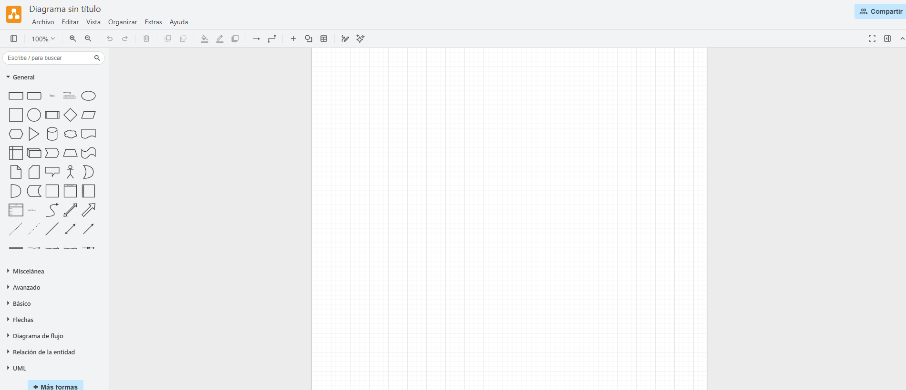
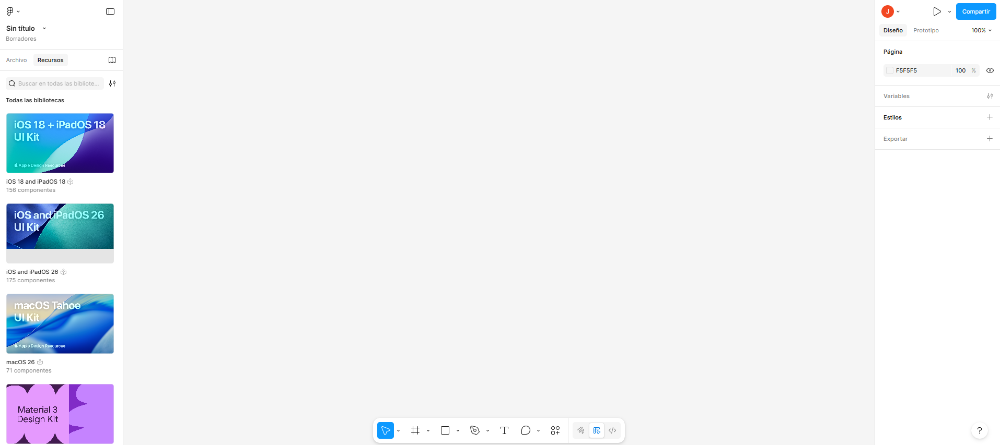
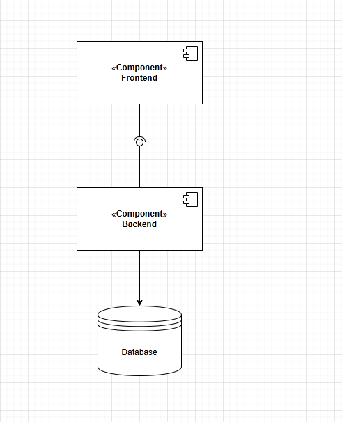

# DOSW_ParcialT2_JeyderLeon

# Jeyder Nicolay leon Lancheros
# GRUPO 1

- Compilar proyecto: mvn clean compile
- Ejecutar tests (JUnit + Mockito): mvn test
- Ejecutar verificación completa (incluye JaCoCo report): mvn clean verify
- Swagger UI: http://localhost:8080/swagger-ui/index.html
- OpenAPI JSON: http://localhost:8080/v3/api-docs
- Ejecutar análisis SonarQube: mvn clean verify sonar:sonar 
- Dsonar.projectKey=DOSW-ParcialT2 
- Dsonar.host.url=http://localhost:9000 
- Dsonar.login=TU_TOKEN
- SonarQube UI: http://localhost:9000
- Levantar la app Spring Boot: mvn spring-boot:run
- App local: http://localhost:8080

# Punto 1

1. Registro con correo institucional.
Verbo: POST

Descripción: cualquier persona con correo institucional puede registrarse proporcionando nombre, correo y contraseña. El sistema crea la cuenta y devuelve la información básica del usuario.

idempotencia= No es una operación idempotente: intentar crear el mismo usuario dos veces dará lugar a un conflicto.

Entradas: nombre, correo institucional, contraseña (todos obligatorios). Salidas: identificador del usuario, nombre, correo y rol.

Validaciones : el correo debe pertenecer al dominio institucional, el correo debe ser único y la contraseña debe cumplir requisitos mínimos de seguridad.

codigos http: 200 creado correctamente, 400 error por datos inválidos o conflicto si el correo ya existe.

2. Inicio de sesión.
Verbo: POST

Descripción: permite a un usuario autenticarse con correo y contraseña. Si las credenciales son válidas se devuelve un token de acceso y la información del usuario.

idempotencia: No es idempotente en el sentido práctico porque genera credenciales de sesión.

Entradas: correo y contraseña (son obligatorios ambos) . Salidas: token de acceso y datos del usuario.

Validaciones: campos obligatorios y credenciales correctas. Respuestas: token en caso de éxito o error de credenciales.

codigos http: 200 inicio de sesion exitoso, 400 no se evidencia el token, credenciales incorrectas

3. Consultar producto mediante código QR.
   
Verbo: GET

Descripción: al escanear un QR se obtiene la ficha del producto: nombre, descripción, precio, código QR, stock y estado (disponible o no).

idempotencia: Es una operación de solo lectura y por tanto idempotente, sie,pre devolvera el mismo producto para el mismo qr.

Entradas: código QR(muy obligatorio). Salidas: información completa del producto.

Validaciones: formato del QR y existencia del producto. Si no existe, se devuelve un error de no encontrado.

codigos http: 200 (producto encontrado), 400 producto no encontrado, no hay autorización, el producto no se encontro

4. Crear pedido con productos escaneados.
Verbo: POST

Descripción: un usuario autenticado puede crear un pedido enviando la lista de productos (identificador o código QR) y las cantidades. El pedido se guarda con estado inicial CREADO y se devuelve su identificador, total y fecha. 

idempotencia: No es idempotente, cada pedido tiene productos distintos.

Entradas: lista de ítems con producto y cantidad(obligatorio). Salidas: identificador del pedido, estado inicial, total y fecha de creación.

Validaciones: que los productos existan, cantidades mayores a cero, stock suficiente y que el usuario no tenga ya un pedido activo.

codigos http: 200 pedido creado exitosamente, 400 no hay productos requeridos,no hay suficiente sotck de el/los productos, tienes un pedido activo

5. Validar stock antes de confirmar.
Verbo: POST

Descripción: comprueba sin modificar nada si hay stock suficiente para las cantidades solicitadas.

idempotencia:Es idempotente porque solo consulta el estado del inventario.

Entradas: lista de ítems(obligatorio). Salidas: por cada producto la cantidad solicitada, la disponible y un indicador de si es suficiente.

Validaciones: cantidades positivas y existencia de producto.

codigos http: 200 stock disponible, 400 el producto no existe

6. Un usuario solo puede tener un pedido activo.

Verbo: GET 

Descripción: regla de negocio que impide a un usuario crear un nuevo pedido si ya tiene uno en estado activo (por ejemplo CREADO o EN_PREPARACION). GET devuelve el pedido activo si existe.

idempotencia: como es una operación de solo lectura es idempotente

Entradas: id del pedido. Salidas: estado del pedido

Validaciones: usuario autenticado y comprobación del estado del pedido.

codigos hhtp: 200 ( consulta del estado ). 400 hay ya un pedido en curso

7. Gestión de estados del pedido.
Verbo: PATCH

Descripción: el personal de la cafetería puede actualizar pedidos a EN_PREPARACION y luego a ENTREGADO. El cliente puede cancelar solo si el pedido está en CREADO. Al confirmar la entrega el sistema debe ajustar el stock.

idempotencia: No es idempotente ya que busca actualizar algo

Entradas: estado objetivo (por ejemplo EN_PREPARACION). Salidas: pedido actualizado.

Validaciones: control de permisos por rol y restricciones en las transiciones de estado.

codigos http: 200 (arroja el estado del pedido actualizado), 400 el rol no es permitido para la acción. el estado del pedido no se puede actualizar

# Punto 2

Input: comprobaciones tecnicas sobre los datos que llegan. 

Ejemplos: campos obligatorios, formato de email, tipos, longitudes, nuumeros positivos. Se hacen en la entrada (controlador/DTO) y evitan errores básicos y ataques.

Negocio: reglas propias del dominio que dependen del estado y la loggica de la app. 

Ejemplos: stock suficiente antes de confirmar un pedido, un usuario solo puede tener un pedido activo, solo el personal puede marcar ENTREGADO. Se validan en la capa de servicio/domain y protegen la coherencia del negocio para que vaya acorde a lo establecido previamente.

# Punto 3

Autenticación: comprobar quién es el usuario

Autorización: decidir qué puede hacer el usuario.

Integridad: asegurar que los datos no fueron alterados.

# Punto 4

# Punto 5

- Mantenimiento difícil: cambios pequeños rompen partes no relacionadas.
- Pruebas complicadas: imposible aislar lógica para unit tests.
- Acoplamiento alto: impide reemplazar o refactorizar componentes.
- Pérdida de reutilización: la lógica no sirve en otros contextos.
- Riesgos operativos y de seguridad: validaciones dispersas y despliegues más complejos.

## Punto 7

Validador

- Qué es: componente que verifica que los datos cumplen reglas concretas (formatos, rangos, campos obligatorios).
- Responsabilidad: validar entrada y devolver errores claros; no realiza lógica de negocio ni efectos secundarios.
- Dónde se usa: capas de entrada controladores, DTOs o antes de ejecutar una operación de negocio.
- Ejemplo: comprobar que un email tenga formato válido o que una cantidad sea positiva.
- Prueba: tests unitarios centrados en reglas de validación.

Utilidad (helper)

- Qué es: función o clase pequeña que aporta una operación reutilizable y técnica, sin estado ni contexto de dominio.
- Responsabilidad: resolver tareas auxiliares formatos, conversiones, cálculos sencillos de forma pura y reutilizable.
- Dónde se usa: en cualquier capa que necesite la operación; no debería contener lógica de negocio.
- Ejemplo: formatear una fecha, calcular el hash de un string, convertir moneda.
- Prueba: tests unitarios que verifiquen entradas/ salidas para casos representativos.

Servicio

- Qué es: componente que encapsula la lógica de negocio, coordina validadores, utilidades y repositorios.
- Responsabilidad: implementar las reglas del dominio, gestionar transacciones y efectos secundarios persistencia, envío de eventos.
- Dónde se usa: desde controladores o jobs; actúa como capa intermedia entre entrada y persistencia.
- Ejemplo: crear un pedido verificar stock, reservar ítems, guardar el pedido y emitir evento.
- Prueba: tests unitarios sobre la lógica mockeando repositorios y pruebas de integración para efectos secundarios.
